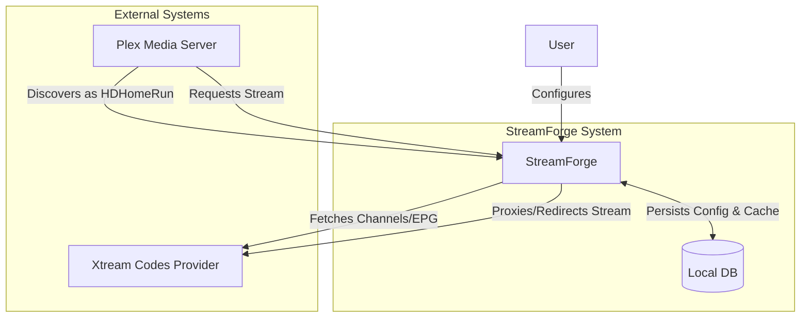

# StreamForge Architecture

## 1. System Overview

StreamForge is a desktop application that acts as a middleware between Xtream Codes IPTV providers and Plex Media Server. It emulates an HDHomeRun tuner device, allowing Plex to consume IPTV channels as if they were coming from a physical tuner, with enhanced features like EPG mapping and stream quality selection.



## 2. Technical Architecture

StreamForge is built using the **Tauri** framework, which allows for a lightweight, secure desktop application with a Rust backend and a web-based frontend.

### Container Diagram

```mermaid
graph TB
    subgraph "StreamForge Application"
        Frontend[Frontend (React/TypeScript)]
        Backend[Backend (Rust)]
    end

    Frontend <-->|Tauri IPC| Backend
    Backend <-->|SQL| SQLite[(SQLite Database)]
    Backend <-->|HTTP| Internet[Internet / Local Network]
```

### 2.1 Frontend (UI Layer)
*   **Framework**: React 18 with TypeScript.
*   **State Management**: `Zustand` for global state (settings, active streams).
*   **Styling**: Tailwind CSS + Radix UI primitives.
*   **Communication**: Invokes Rust commands via `@tauri-apps/api`.

### 2.2 Backend (Core Layer)
The backend is written in Rust and handles the heavy lifting: network emulation, data persistence, and stream management.

#### Core Components:

1.  **Axum Server (`server/`)**:
    *   Runs a local HTTP server (typically port 3000 or random).
    *   Exposes HDHomeRun-compatible endpoints:
        *   `/discover.json`: Device identification.
        *   `/lineup.json`: List of available channels.
        *   `/auto/v{channel_id}`: Stream endpoint.
    *   Handles stream proxying to ensure stable connections to Plex.

2.  **Xtream Client (`xtream/`)**:
    *   Manages authentication and communication with IPTV providers.
    *   Fetches Live Streams, VOD, and EPG data.
    *   Handles parsing of M3U and JSON responses.

3.  **Channel Matcher (`matcher/`)**:
    *   Logic for mapping XMLTV EPG data to Xtream streams.
    *   Uses string similarity algorithms (`strsim`) to automatically associate guide data with channels.

4.  **Database Layer (`db/`)**:
    *   Uses `Diesel` ORM with SQLite.
    *   **Tables**:
        *   `accounts`: Xtream credentials.
        *   `xtream_channels`: Cached channel list from provider.
        *   `xmltv_channels`: EPG data sources.
        *   `channel_mappings`: Links between Xtream channels and XMLTV IDs.

5.  **Scheduler (`scheduler/`)**:
    *   Background tasks for keeping data fresh.
    *   Periodically syncs channels and EPG data from providers.

## 3. Data Flow

### 3.1 Channel Sync Flow
1.  Scheduler triggers a sync job.
2.  `XtreamClient` fetches the latest channel list from the provider.
3.  New channels are inserted into `xtream_channels`.
4.  `Matcher` runs to find EPG matches for new channels based on name similarity.
5.  Results are saved to `channel_mappings`.

### 3.2 Playback Flow
When a user tunes into a channel on Plex:

1.  **Request**: Plex requests `http://<streamforge-ip>:<port>/auto/v<channel_id>`.
2.  **Lookup**: Backend looks up `channel_id` in the database to find the corresponding Xtream stream URL.
3.  **Session**:
    *   Checks if the provider allows concurrent connections.
    *   If Proxy Mode is enabled: StreamForge opens a connection to the Xtream provider and pipes chunks to Plex.
    *   If Redirect Mode is enabled (future): StreamForge returns a 302 Redirect to the direct provider URL.
4.  **Monitoring**: The active stream is tracked in memory to enforce connection limits.

## 4. Security & Credentials

Security is a priority for handling user credentials.

*   **Primary Storage**: OS-native Keychain (via `keyring` crate).
    *   macOS Keychain
    *   Windows Credential Manager
    *   Linux Secret Service / Keyring
*   **Fallback Storage**: AES-256-GCM Encryption.
    *   If the OS Keychain is unavailable, credentials are encrypted using a machine-specific key derived via HKDF-SHA256.
    *   The encrypted blob is stored in the local SQLite database.

## 5. Database Schema

Key entities in the `db/schema.rs`:

*   **`accounts`**: Stores provider connection details.
*   **`xtream_channels`**: Represents raw streams available from the provider.
*   **`xmltv_sources`** & **`xmltv_channels`**: Represents EPG data imported from XMLTV URLs.
*   **`channel_mappings`**: The critical link table that joins an `xtream_channel` (stream) to an `xmltv_channel` (guide data).

## 6. Development

See `README.md` for build and run instructions.
